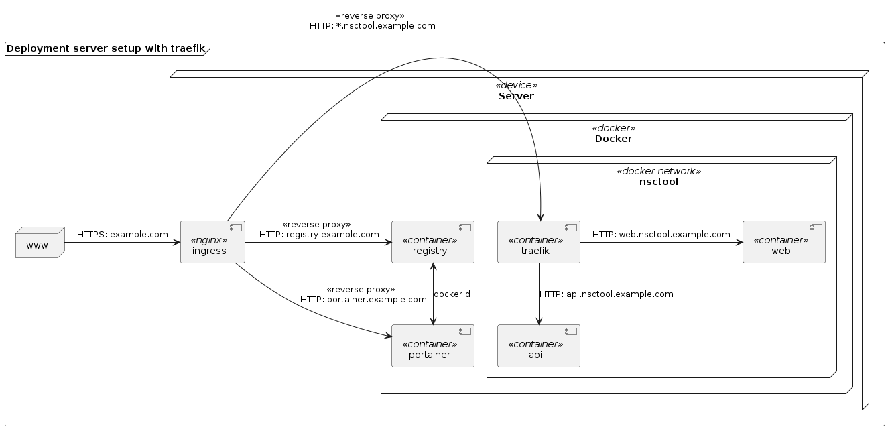

Architecture Documentation
===
This documentation contains all documentation related to architecture of the NSCTool.

## C4 model
* Level 1: [System Context](./c4/01-system-context.md)
* Level 2: [Container Diagram](./c4/02-container-diagram.md)
* Level 3: [Component Diagram](./c4/03-container-diagram.md)
* Level 4: [Code](./c4/04-code.md)

## (m)ADR
TODO

## Arc42
TODO

## Deployment Server
This deployment diagram illustrates the current server set-up used for deployment.
The ingress [nginx](https://www.nginx.com/) server is deployed native on the server.
It forwards HTTPS requests to the different services deployed in docker by using reverse prox pass.
This way the SSL encryption and certificate handling is managed on the server by nginx and all components in the docker network can use HTTP.

For managing the nsctool network, a [docker network](https://docs.docker.com/network/) called `nsctool` is used to isolate the network. 
The network itself is not managed by any docker-compose files but created manually by running `docker network create nsctool`.

In the `nsctool` network a [traefik](https://doc.traefik.io/traefik/) container is deployed for routing requests within the network between the services.
For now, the traefik service is managed in a own docker-compose file on the host server. 
Maybe we want to migrate it into this repository.

