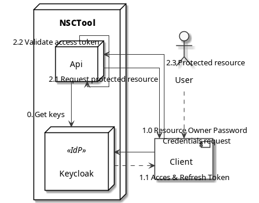

API
===

We are using [OIDC](https://connect2id.com/learn/openid-connect) to secure our API.
As an Identity Provider (IdP) [Keycloak](https://www.keycloak.org/) is used.
Our API server is used as a Resource Server in the context of OIDC/OAuth2.

## Authentication flow

In the following diagram the basic flow for authentication and authrization is described.

Flow:

- 0: On startup, the API server requests the current public signing keys for JWT.
- 1.0: The client requests an access token by using the `Resource Owner Password Credentials` flow.
- 1.1: The IdP validates the requests and sends back an acces and refresh token (as JWT).
- 2.1: The Client requests a protected resource by sending the Access Token in the `Authentication: Bearer` header.
- 2.2: The API server validates the signature of the JWT with the requested public keys in step 0.
- 2.3: The API server returns the protected resource, if authentication and authorization was successful.

## Spring Security

TODO: Describe token validation, roles claim and user management in the API server.
